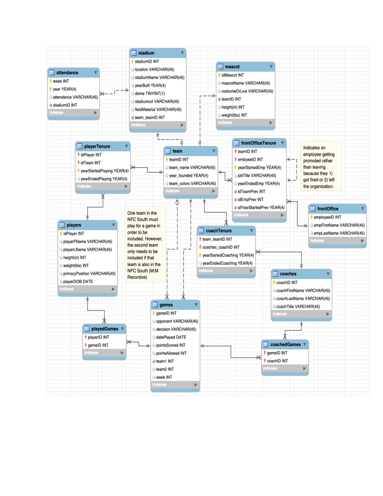

# MIST-4610-Group-3-Project-1

## Team Name:
Group 3

## Team Members:

1. Ayanna Patel [@ayannapatel](https://github.com/ayannapatel14)
2. Charles Wu [@charleswu](https://github.com/CharlesWu0109)
3. Dhruv Desai [@dhruvdesai](https://github.com/Dvdesai)
4. Moheb Veerani [@mohebveerani](https://github.com/mohebveerani-glitch)
5. Emnet Endalk [@emnetendalk](https://github.com/emnete-cell)

## Problem Description:
The objective of this project is to design and implement a relational database that captures the operations of a professional football organization. The central entity in the model is the Team, which represents each franchise within the league. Every team is associated with players, coaches, mascots, and front office employees who contribute to the organization’s success both on and off the field. This model focuses on accurately representing the relationships between these entities, including player tenure, coaching assignments, staff promotions, and team performance in scheduled games. It also accounts for external factors such as stadium details, attendance tracking, and inter-team matchups that influence overall league statistics. By creating and populating this database with realistic sample data, we aim to simulate a working system that supports queries related to player performance and team management efficiency. Ultimately, the database will serve as a foundation for generating insights that can improve strategic decision-making and operational planning within a professional sports organization.

## Data Model:
Explaination of the Data Model:

Our data model represents the inner workings of a professional football league, focusing on how teams, players, coaches, and staff interact throughout each season. At the center of the model is the Team entity, which includes details such as the team’s name, year founded, and colors. From this core, multiple relationships branch out to capture the dynamic nature of sports organizations—covering rosters, coaching staff, front-office management, stadium operations, and seasonal performance.

The Players table stores detailed information on every athlete in the league. Since players often move between teams over the course of their careers, we introduced a bridge entity called PlayerTenure to track when each player joins and leaves a specific team. This design allows the database to maintain a clear history of player affiliations without duplicating data. Similarly, the Coaches table works alongside the CoachTenure entity to document each coach’s time spent with a team, reflecting career progression and transitions across the league.

Front-office operations are represented through the FrontOffice and FrontOfficeTenure entities. These tables capture information about employees’ job titles, start and end years, and any internal promotions—allowing for a comprehensive record of staff history within each organization.

The Stadium table holds information about each team’s home venue, such as its name, location, construction year, and field surface. It connects directly to the Team entity to indicate ownership or association. Attendance data, stored in the Attendance table, is tied to specific stadiums to record weekly or yearly fan turnout, supporting analyses of audience engagement over time.

Each team is also linked to a Mascot entity, which provides descriptive attributes like mascot type, costume, height, and weight—adding personality to each franchise and capturing an often-overlooked part of team identity.

Game operations are modeled through the Games table, which records information about every match, including the participating teams, final score, week of play, and outcome. Because two teams are involved in each game, the model includes recursive relationships using dual foreign keys (team1 and team2). The associative entities PlayedGames and CoachedGames connect individual players and coaches to specific matches, ensuring that every participant’s performance can be tracked across the season.

Overall, this database effectively mirrors the complexity of a football organization. It allows for deep insights into performance trends, career timelines, staff movements, and fan participation. With this relational model, queries can explore everything from historical coaching records to player statistics and stadium attendance, providing a powerful analytical foundation for understanding the operations of a professional sports league.

## Data Dictionary:

## Queries:

