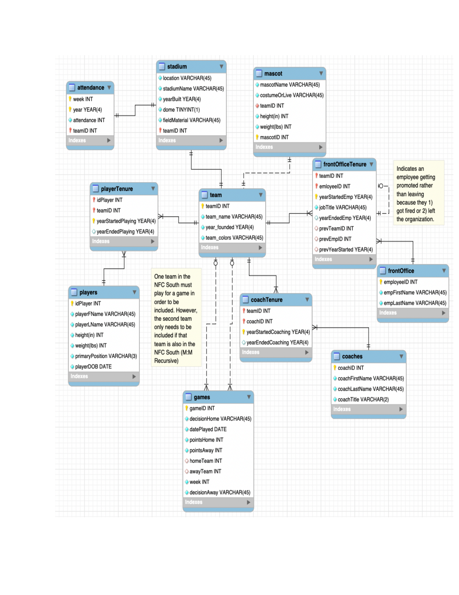

# MIST 4610 Project1 Group 3 

## Team Name:
Group 3

## Team Members:

1. Ayanna Patel [@ayannapatel](https://github.com/ayannapatel14)
2. Charles Wu [@charleswu](https://github.com/CharlesWu0109)
3. Dhruv Desai [@dhruvdesai](https://github.com/Dvdesai)
4. Moheb Veerani [@mohebveerani](https://github.com/mohebveerani-glitch)
5. Emnet Endalk [@emnetendalk](https://github.com/emnete-cell)

## Problem Description:
The objective of this project is to design and implement a relational database that captures the operations of a professional football organization. The central entity in the model is the Team, which represents each franchise within the league. Every team is associated with players, coaches, mascots, and front office employees who contribute to the organization’s success both on and off the field. This model focuses on accurately representing the relationships between these entities, including player tenure, coaching assignments, staff promotions, and team performance in scheduled games. It also accounts for external factors such as stadium details, attendance tracking, and inter-team matchups that influence overall league statistics. By creating and populating this database with realistic sample data, we aim to simulate a working system that supports queries related to player performance and team management efficiency. Ultimately, the database will serve as a foundation for generating insights that can improve strategic decision-making and operational planning within a professional sports organization.

## Data Model:
Explaination of the Data Model:

Our data model represents the inner workings of a professional football league, focusing on how teams, players, coaches, and staff interact throughout each season. At the center of the model is the Team entity, which includes details such as the team’s name, year founded, and colors. From this core, multiple relationships branch out to capture the dynamic nature of sports organizations—covering rosters, coaching staff, front-office management, stadium operations, and seasonal performance.

The Players table stores detailed information on every athlete in the league. Since players often move between teams over the course of their careers, we introduced a bridge entity called PlayerTenure to track when each player joins and leaves a specific team. This design allows the database to maintain a clear history of player affiliations without duplicating data. Similarly, the Coaches table works alongside the CoachTenure entity to document each coach’s time spent with a team, reflecting career progression and transitions across the league.

Front-office operations are represented through the FrontOffice and FrontOfficeTenure entities. These tables capture information about employees’ job titles, start and end years, and any internal promotions—allowing for a comprehensive record of staff history within each organization.

The Stadium table holds information about each team’s home venue, such as its name, location, construction year, and field surface. It connects directly to the Team entity to indicate ownership or association. Attendance data, stored in the Attendance table, is tied to specific stadiums to record weekly or yearly fan turnout, supporting analyses of audience engagement over time.

Each team is also linked to a Mascot entity, which provides descriptive attributes like mascot type, costume, height, and weight—adding personality to each franchise and capturing an often-overlooked part of team identity.

Game operations are modeled through the Games table, which records information about every match, including the participating teams, final score, week of play, and outcome. Because two teams are involved in each game, the model includes recursive relationships using dual foreign keys (team1 and team2). The associative entities PlayedGames and CoachedGames connect individual players and coaches to specific matches, ensuring that every participant’s performance can be tracked across the season.

Overall, this database effectively mirrors the complexity of a football organization. It allows for deep insights into performance trends, career timelines, staff movements, and fan participation. With this relational model, queries can explore everything from historical coaching records to player statistics and stadium attendance, providing a powerful analytical foundation for understanding the operations of a professional sports league.

## Data Dictionary:

## Queries:

---

1. Query 1 retrieves a list of all NFL players who are taller than 75 inches and weigh more than 200 pounds from the players table. It displays each player’s first name, last name, height, and weight, allowing users to easily view players who meet both physical criteria.

This query is useful for coaches, scouts, or analysts who want to identify players with above-average size — typically offensive or defensive linemen, tight ends, or other physically demanding positions. By filtering based on both height and weight, it provides a focused view of players who possess a larger physical build, which can be valuable for evaluating roster composition, game strategy, or player comparisons.

---
2. Query 2 calculates the average attendance for each NFL stadium by combining data from the attendance, team, and stadium tables. It uses the AVG() function to find the mean attendance value for all games played in each stadium and groups the results by stadium name.

This query helps teams, analysts, and management understand fan engagement and stadium popularity. By viewing the average attendance per venue, organizations can identify which stadiums consistently draw larger crowds and which may need marketing improvements or fan experience enhancements. It provides valuable insight into audience trends and event performance across all NFC South stadiums.

---
3. Query 3 calculates the average height and weight of players for each primary position in the players table. Using the AVG() function, it computes the mean values of both height(in) and weight(lbs), and the ROUND() function ensures the results are neatly rounded to two decimal places. The results are grouped by primaryPosition, giving one row per position.

This query provides valuable insight into the physical characteristics typical for each position, such as how linemen tend to be taller and heavier compared to wide receivers or defensive backs. Coaches, scouts, and analysts can use this data to evaluate player build trends, guide recruitment decisions, and ensure players meet the ideal size profiles for their respective roles on the field.

---
4. Query 4 lists all NFC South matchups — including the Saints, Falcons, Panthers, and Buccaneers — and calculates the average point difference between each pair of teams based on their previous games against each other. The query joins the games table with the team table twice (once for the home team and once for the away team) and uses the REGEXP function to ensure that only games between these four teams are included.

This query is helpful for analyzing divisional rivalries within the NFC South. It allows analysts and coaches to quickly identify which teams tend to dominate specific matchups and which rivalries are more evenly contested, providing strategic insights for future games and performance evaluations.

---
5. Query 5 retrieves all players who have played for teams with stadiums built before 1990. It uses the EXISTS condition to check if a player’s ID appears in the playerTenure table for a team whose associated stadium was constructed before 1990. By joining the playerTenure, team, and stadium tables it ensures that only players connected to these older stadiums are included.

This query helps identify players who have been part of historic or long-standing franchises that play in older stadiums, such as the Caesars Superdome. It’s useful for analyzing veteran players or those with experience in traditional venues, and can also provide insight into franchise longevity, stadium history, and player-team relationships over time.

---
6. 

___
8. Query 8 returns the team name, and the amount of in-organization promotions that have occurred between the 2022-2024 NFL seasons in the NFC South.

Query 8 allows owners to understand organizations that see a lot of position changes yet also rely more heavily on those within the organization to fill such spots. Depending on the success of a franchise, this may make other teams decide to follow that strategy, like the Buccaneers winning the NFC South division more often as of recent compared to other teams. 
___
9. Query 9 returns the average attendance figure of a home game for teams in the NFC South between the 2022-2024 NFL seasons. 

Query 9 allows an owner (and other front office staff) about how well their team is doing relative to other teams in the NFC South in terms of attendance. This can indicate the success of promotions, or bringing out competitive teams each night. Furthermore, this allows for vendors a franchise works with to properly adjust to changing attendance figures over time to maximize profits and ensure no wastage of food (which can be costly). 
___
10. Query 10 returns the average attendance figure of a home game for teams in the NFC South when going against a team in their own division between the 2022-2024 NFL seasons.

Query 10 allows an owner (and other front office staff) about how well their team is doing relative to other teams in the NFC South in marketing their matches against one another. It also shows how tight of a rivalry it really is and shows potentially more or less demand compared to average home figures as shown in query 9. This can be used to develop marketing strategies in regards to said matchups. 
